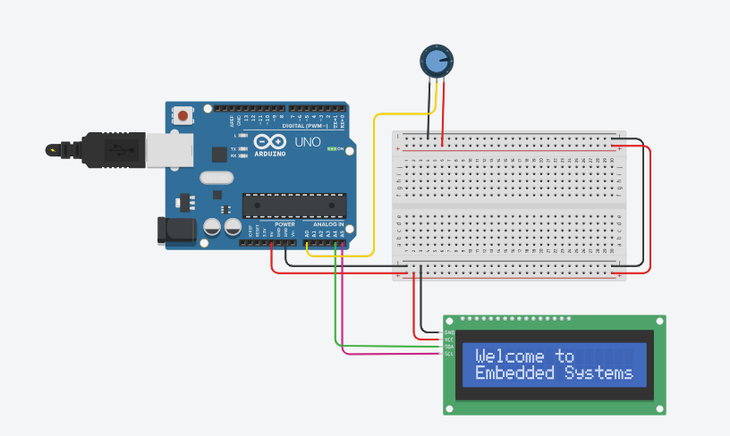

#  Arduino LCD Display with I2C + Potentiometer

This project uses a potentiometer to control an LCD display via I2C interface on an Arduino Uno. The LCD shows real-time analog readings and tracks whether the value is increasing, decreasing, or stable.

---

##  Components Used

- Arduino Uno
- I2C 16×2 LCD Display
- 10kΩ Potentiometer
- Breadboard
- Jumper Wires
- USB Cable

---

##  How It Works

- The potentiometer is connected to analog pin `A0`
- The LCD is connected via I2C (address: `32` for Tinkercad, may vary in real modules)
- On boot, the LCD displays "Welcome to Embedded Systems"
- The main loop:
  - Reads analog value from the potentiometer
  - Displays the value on the first line
  - Shows a status message: `Increasing`, `Decreasing`, or `Stable` based on the change

---

##  Pin Connections

| Component        | Arduino Pin |
|------------------|-------------|
| Potentiometer OUT| A0          |
| I2C LCD SDA      | A4          |
| I2C LCD SCL      | A5          |
| I2C LCD VCC      | 5V          |
| I2C LCD GND      | GND         |

> 🔎 I2C address used in the code: `32`  
> You may need to change to `0x27` or `0x3F` based on your hardware.

---

##  Circuit Diagram



---

##  Full Arduino Code

```cpp
#include <Wire.h>
#include <LiquidCrystal_I2C.h>

// I2C address may vary: 0x27, 0x3F, or 32 for Tinkercad
LiquidCrystal_I2C lcd(32, 16, 2);
int potPin = A0;

int value = 0;
int lastValue = 0;

void setup() {
  lcd.init();
  lcd.backlight();
  lcd.clear();

  lcd.setCursor(0, 0);
  lcd.print("Welcome to");
  lcd.setCursor(0, 1);
  lcd.print("Embedded Systems");

  delay(3000);
  lcd.clear();

  pinMode(potPin, INPUT);
  Serial.begin(9600);
}

void loop() {
  value = analogRead(potPin);

  Serial.print("Potentiometer value: ");
  Serial.println(value);

  lcd.setCursor(0, 0);
  lcd.print("Pot value:");
  lcd.setCursor(10, 0);
  lcd.print("     ");
  lcd.setCursor(10, 0);
  lcd.print(value);

  lcd.setCursor(0, 1);
  if (value > lastValue) {
    lcd.print("Increasing     ");
  } else if (value < lastValue) {
    lcd.print("Decreasing     ");
  } else {
    lcd.print("Stable         ");
  }

  lastValue = value;
  delay(200);
}
